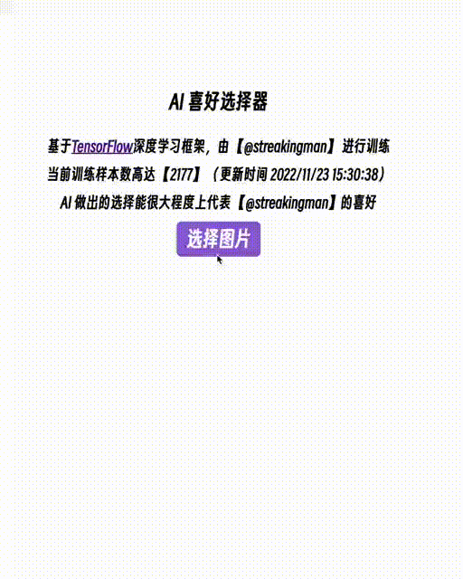

# fake-ai-which-is-better-selector

这个项目没有使用任何深度学习框架，都是模拟的🐶，用来应付"哪一件更好看"之类的问题

## Features

-   完全本地模拟，无信息泄漏风险
-   根据文件 md5 进行排序后选第一个，同样的样本，结果必定相同，即使改文件名也不会露馅
-   本地会模拟样本数量和更新时间，提高可信度
-   如果对方使用了不同的终端，那可能会露馅
-   url 配置昵称 `http://127.0.0.1:5173/?nickname=yourname` ，可替换文本

## TODO

-   [ ] 更炫酷的 UI
-   [ ] 更多的骚话
-   [ ] 可配置项目
